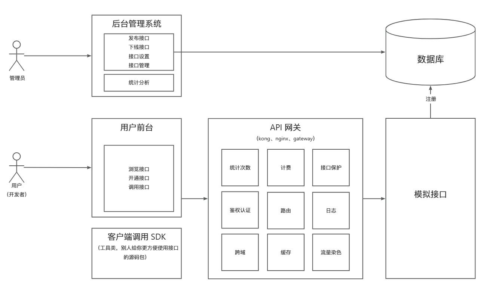

# 壹默接口项目说明
## 1.模块组成
1.1 yimoapi-backend-parent #项目后端
1.2 yimoapi-fronted #项目前端
1.3 yimoapi-sdk #api-sdk
1.4 usesdk #模拟客户端使用sdk调用接口
## 2.技术栈
后端：
Spring Boot、Spring Cloud、Gateway、OpenFeign、Spring Starter开发、Mybatis-Plus、Nacos、OkHttp3

前端:
Vue、Vite、View Design、Pinia、Axios

## 3.项目架构

